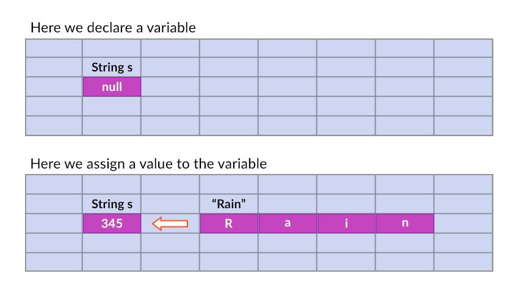
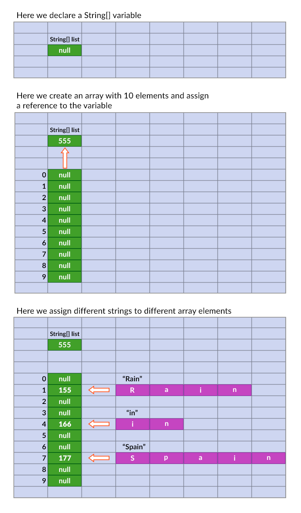

# Array and List

## String


## Array
`String[] list = new String[10];`

```java
public class MainClass
{
    public static void main(String[] args)
    {
        int[] numbers = new int[10];

        for (int i = 0; i < numbers.length; i++)
        {
           numbers[i] = i + 1;
        }
    }
}

public class MainClass
{
  public static void main(String[] args) throws IOException
  {
    // Reading strings from keyboard
    BufferedReader reader = new BufferedReader(new InputStreamReader(System.in));
    String[] list = new String[10];

    for (int i = 0; i < list.length; i++)
    {
      list[i] = reader.readLine();
     }
    // Reading integers from keyboard
    //BufferedReader reader = new BufferedReader(new InputStreamReader(System.in));
    //int[] list = new int[10];

    //for (int i = 0; i < list.length; i++)
    //{
    //  String s = reader.readLine();
    //  list[i] = Integer.parseInt(s);
    //}

  }
}
```