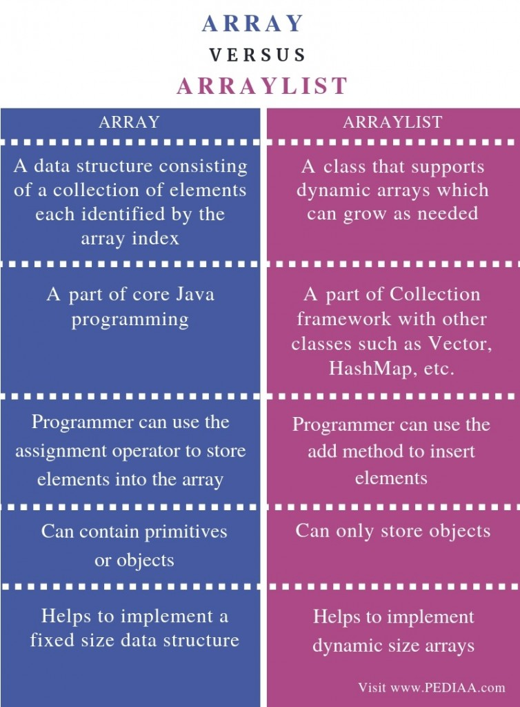

# Array and List
- [String](#String)
- [Array](#Array)
- [ArrayList](#ArrayList)

## String


## Array
Simple fixed sized arrays.  
`String[] list = new String[10];`

```java
public class MainClass
{
    public static void main(String[] args)
    {
        int[] numbers = new int[10];

        for (int i = 0; i < numbers.length; i++)
        {
           numbers[i] = i + 1;
        }
    }
}

public class MainClass
{
  public static void main(String[] args) throws IOException
  {
    BufferedReader reader = new BufferedReader(new InputStreamReader(System.in));
    String[] list = new String[10];

    for (int i = 0; i < list.length; i++)
    {
    // Reading strings from keyboard
      list[i] = reader.readLine();
    // Reading integers from keyboard
    //  list[i] = Integer.parseInt(s);
     }
  }
}
```

## ArrayList
Dynamic sized arrays in Java that implement List interface. 
```java
//Array	
String[] list = new String[10];
int n = list.length;
String s = list[3];     //get element
list[3] = null;

// ArrayList
ArrayList<String> list = new ArrayList<String>();
int n = list.size();
String s = list.get(3); //get element
list.add(s);        //add element at the end
list.add(15, s);    //add element in the middle
list.add(0, s);     //add element at the beginning
list.remove(3);     //delete element in the middle
```
Sample code: 
```java
public static void main(String[] args)
{
    Reader r = new InputStreamReader(System.in);
    BufferedReader reader = new BufferedReader(r);
    
    //Array
    //String[] list = new String[10];
    
    //ArrayList
    ArrayList<String> list = new ArrayList<String>();
    
    for (int i = 0; i < list.length; i++) {
      String s = reader.readLine();
      list[i] = s;
    }
    
    for (int i = 0; i < list.length; i++) {
      int j = list.length - i - 1;
      
      //Array
      //System.out.println( list[j] );
    
      //ArrayList
      System.out.println( list.get(j) );
    }
}
```



