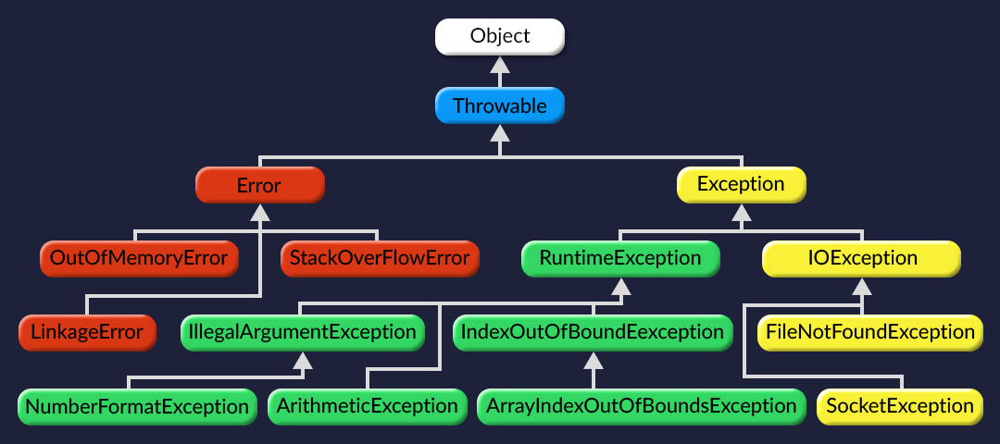

#  try catch finally 

In Java only throwable objects (Throwable objects are instances of any subclass of the Throwable class) can be thrown as exception. So basic data type can no be thrown at all. 

In Java, the finally is always executed after the try-catch block whether an exception occurs or not.. This block can be used to do the common cleanup work. 

ArithmeticException is an unchecked exception, i.e., not checked by the compiler. So the program compiles fine. 

`throw` keyword is used to explicitly throw an exception. 

`Throwable` class is the superclass of all errors and exceptions in the Java language.

1.如果 try 块中发生异常，代码会在发生异常的位置停止执行，此时 catch 块开始执行。

2.如果没有异常发生，那么 try 块执行到最后，而且 catch 块不会执行。”

“想象一下，在每个方法调用之后，我们都会检查该方法是正常返回还是由于异常而突然终止。如果发生异常，那么我们继续执行 catch 块（如果有）来捕获异常。如果没有 catch 块，那么我们终止当前方法，然后调用我们的方法执行相同的检查。”

“所有的异常都是继承 Exception 类的类。我们可以在 catch 块中指定异常类来捕获特定的异常，或者我们指定它们的公有父类 Exception 来捕获所有异常。然后，我们可以从变量 e 中获取所有必要的错误信息（它存储了异常对象的参考信息）。”

