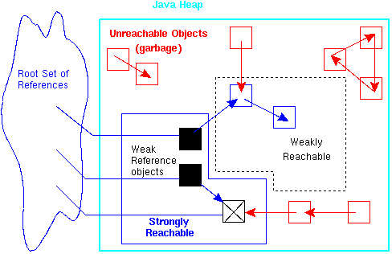
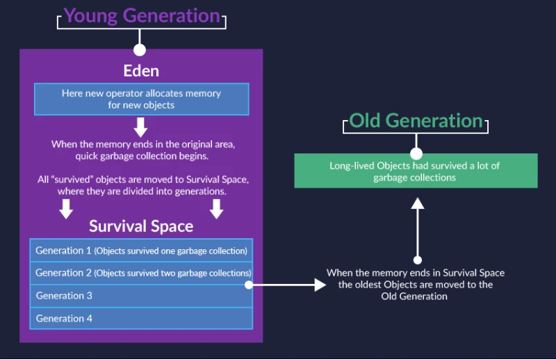

# Static
* 
“Java 方法分为两个类别。
实例方法是在对象上调用的，并且可以访问该对象的数据。
static 方法没有该访问权限，因为它们根本没有对象引用。
但是，它们可以引用类的 static 变量和其他 static 方法。

static 方法无法处理非 static 方法或非 static 变量！”


# Object Lifecycle
Creating any object causes the Java machine to allocate memory for it. Objects have their own lifecycle.
* Begin an object's life: **when it is created**. The Java virtual machine allocates the memory necessary to create the object.
  - <font color="red">The object is "alive" **as long as there are references to it**. As soon as there are no references, the object "dies".</font>
* **Memory leaks**: memory which is no longer needed is not released; one of the most unpleasant bugs. 
* Java's built-in **garbage collector (GC)**: an internal Java mechanism responsible for freeing up **_memory_** (Not the object itself). 
GC reaches an object when the special `finalize()` method is called.
    ```java
    class Cat
    {
        String name;
    
        Cat(String name)
        {
            this.name = name;
        }
    
        protected void finalize() throws Throwable
        {
            System.out.println(name + " destroyed");
        }
    }
    ```
  - `finalize()` method: belongs to the Object class. It's similar to `equals()`, `hashCode()` and `toString()`. Every object has it.
  - the garbage collector works in parallel with the program. It is not part of the program but runs separately.
* The Java machine itself determines whether to call finalize() on a case by case basis. **Don't rely on the finalize() method to release critical resources.**

* <font color="blue">Java's modern garbage collector doesn't count references. </font>It determines whether an object is <font color="red">**Reachable Object**</font> or <font color="red">**Unreachable Object**</font>.
  - <font color="green">**Root Reference**</font>: the one directly created in executable code.
  - <font color="green">**Reachable Object**</font>: can be traced along to reference chain from an object to the root reference. 
  - <font color="green">**Unreachable Object**</font>: the object drops out of this chain; none of the variables in the code currently being executed references it, and it cannot be reached through the reference chain.

* All Java objects are stored in a special area of memory called the **heap**. 
They could be divided into two types: **simple objects** and **long-lived objects**. 
  - <font color="green">**Long-lived Objects**</font>: objects that have survived many rounds of garbage collection. They usually live until the program ends.
  
* **Heap Memory in Java**: the runtime data area from which the Java VM allocates memory for all class instances and arrays. 
The heap may be of a fixed or variable size. The garbage collector is an automatic memory management system that reclaims heap memory for objects. 
  - <font color="green">**Young Generation**</font>: where all new objects are allocated and aged. 
    - **Eden Space**: the pool from which memory when we use the keyword *new*; initially allocated for most objects.
      
    - **Survivor Space**: the pool containing objects that have survived the garbage collection of the Eden space.

    - A minor Garbage collection occurs when this fills up. 
  - <font color="green">**Old/Tenured Generation**</font>: where long surviving objects are stored. They have existed for some time in the survivor space.
    - When objects are stored in the Young Generation, a threshold for the object's age is set and when that threshold is reached, the object is moved to the old generation

* **Non-heap Memory**: includes a method area shared among all threads and memory required for the internal processing or optimization for the Java VM. 
It stores per-class structures such as a runtime constant pool, field and method data, and the code for methods and constructors. The method area is logically part of the heap but, depending on the implementation, a Java VM may not garbage collect or compact it. 
Like the heap memory, the method area may be of a fixed or variable size. The memory for the method area does not need to be contiguous.
  - <font color="green">**Permanent Generation**</font>: consists of JVM metadata for the runtime classes and application methods. 
    - The pool containing all the reflective data of the virtual machine itself, 
  such as class and method objects. 
    - With Java VMs that use class data sharing, this generation is divided into read-only and read-write areas.
  - <font color="green">**Code Cache**</font>: containing memory that is used for compilation and storage of native code.
